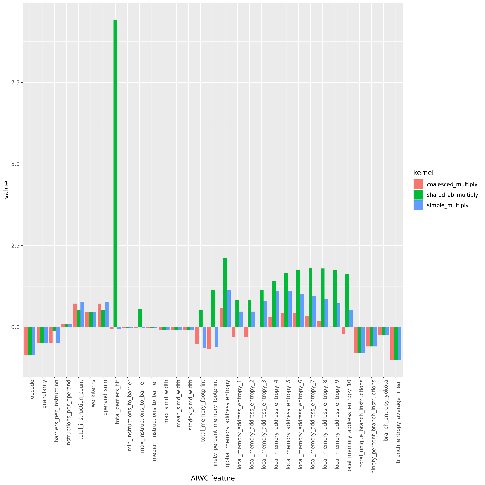
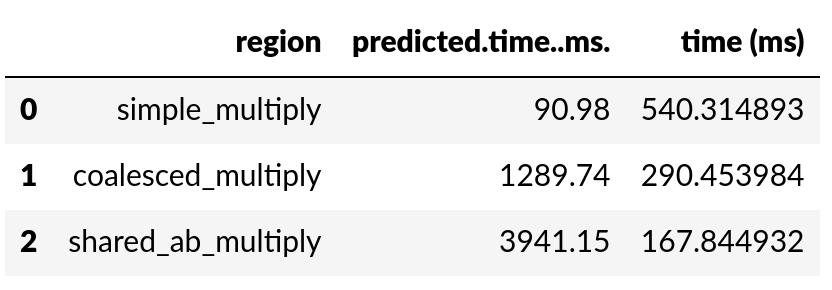

# Comparing AIWC Feature Spaces for Optimised CUDA Codes at Varying Problem Sizes

The matrix multiplication problem can be optimised in CUDA by bringing the input matrices into shared memory, avoiding
repeated high latency low bandwidth access to global memory.

The coalesced_multiply code only places matrix A into shared memory, while sharedABMultiply places both A and B in shared memory, with B placed like:

```{C}
    aTile[threadIdx.y][threadIdx.x] = a[row*TILE_DIM+threadIdx.x];
    bTile[threadIdx.y][threadIdx.x] = b[threadIdx.y*N+col];
```


## Comparing feature spaces of varyingly optimised CUDA Codes at a fixed Problem Size



Consistently we find that the barrier-based metrics for the sharedABMultiply kernel are significantly worse than the same for the unoptimised and coalescedMultiply kernels.

> "Note that in Improvement by reading additional data into shared memory, a `__syncthreads()` call is required after reading the B tile because a warp reads data from shared memory that were written to shared memory by different warps." 
    -- [Cuda Optimisation Handbook](https://docs.nvidia.com/cuda/cuda-c-best-practices-guide/index.html#shared-memory-in-matrix-multiplication-c-aa)

On a separate topic, the ML model's prediction of runtimes based on the AIWC metrics are quite off the measured runtimes. In fact, the `shared_ab_multiply` is consistently (across the problem sizes) predicted to perform the *worst* of the three kernels. For example, for the large problem size:



Looking at the ot